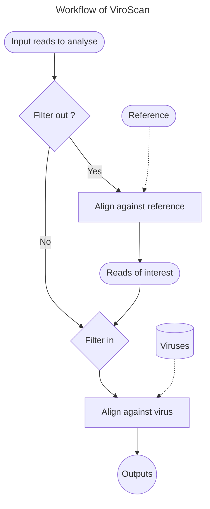

# ViroScan

## Table of contents

- [ViroScan](#ViroScan)
  * [Table of contents](#table-of-contents)
  * [Foreword](#foreword)
  * [Context](#context)
  * [Output](#output)
  * [To start](#to-start)
    + [Prerequisite](#Prerequisite)
    + [Installation](#installation)
  * [Starting up and using](#starting-up-and-using)
    + [Usage](#usage)
    + [Parameters](#parameters)
      + [Mandatory options](#mandatory-options)
      + [Supplementary options](#supplementary-options)
  * [Made with](#made-with)
  * [Author](#author)


## Foreword

ViroScan is an automated pipeline that eliminate reads not of interest according to a reference (filter-out) and identify viruses present (filter-in).




## Context

Knowing the type of virus present in a sample is essential for certain types of research. In the case of papillomaviruses, a DEIA and LIPA combination is often carried out on the bench to determine whether or not HPVs are present and then to type the sample. However, this approach has certain limitations, notably the financial cost, the time required and the range of HPVs that can be detected. With ViroScan, we are trying to overcome these limitations and make more.

## Output

ViroScan create 1 folder `log` and 3 folders of `output` : 
- `data` with the reads mapped and unmapped against the reference indexed during the step of filter-out (in order `data/filter_out/matched` and `data/filter_out/unmatched`) and the reads mapped against viruses during the step of filter-in (`data/filter_in`)
- `analysis` with the output of breseq created during the step of filter-in
- `evidences` with the tables `filterin.counts.txt`, `refs.percents.txt` and `refs.coverage.txt`

```bash
|_ log
|_ output
      |_ analysis
      |_ data
           |_ filter_out
                  |_ matched
                  |_ unmatched
           |_ filter_in
      |_ evidences
```

Here an exemple of : 
- the table filterin.counts.txt

```bash
SAMPLE	NBR_READS_TO_ALIGN	NBR_TOTAL_READS_ALIGNED
sample1	261604	170895
sample2	968370	944474
```

| Field    | Description                                                  |
| --------- | ------------------------------------------------------------ |
| SAMPLE       | The name of sample analyse |
| NBR_READS_TO_ALIGN       | Number of the reads to analyse into the step filter-in |
| NBR_TOTAL_READS_ALIGNED       | Number of the total reads aligned against viruses |

- the table refs.percents.txt

```bash
SAMPLE	REFERENCE	PERCENT_OF_READS_ALIGNED
sample1 	 FM955841 	 16.3
sample1 	 HPU31785 	 7.3
sample1 	 PPH5CG 	 53.6
sample1 	 X55965 	 22.0
sample2 	 HPU31781 	 99.3
```

| Field    | Description                                                  |
| --------- | ------------------------------------------------------------ |
| SAMPLE       | The name of sample analyse |
| REFERENCE       | The LOCUS name of the Genbank reference |
| PERCENT_OF_READS_ALIGNED       | The percent of reads aligned against the virus |

- the table refs.coverage.txt

```bash
SAMPLE	REFERENCE	AVERAGE_COVERAGE	MIN_DEPTH	MAX_DEPTH BASES_COVERED_AT_LEAST_TWICE BASES_COVERED_AT_LEAST_TWENTY_TIMES
sample1 FM955841	460.099	0	2614	2097	2095
sample1	HPU31785	204.656	0	1662	2419	2136
sample1	PPH5CG	1497.15	0	7998	5552	4101
sample1	X55965	601.908	0	4321	1542	1539
sample2	HPU31781	7545.88	1	8002	7323	7323
```

| Field    | Description                                                  |
| --------- | ------------------------------------------------------------ |
| SAMPLE       | The name of sample analyse |
| REFERENCE       | The LOCUS name of the Genbank reference |
| AVERAGE_DEPTH       | Average depth |
| MIN_DEPTH       | Minimum depth |
| MAX_DEPTH       | Maximum depth |
| BASES_COVERED_AT_LEAST_TWICE       | Number of covered bases with depth > 2 |
| BASES_COVERED_AT_LEAST_TWENTY_TIMES     | Number of covered bases with depth > 20 |

## To start

### Prerequisite

- Scripts :

  - bash file config.sh into the config directory

  - python script write_output_tables.py into the src directory

- Tools :

  - Bowtie2 (http://bowtie-bio.sourceforge.net/bowtie2/index.shtml)
  - Python3 (https://www.python.org/downloads/)
  - R (https://www.r-project.org/)
  - breseq (https://barricklab.org/twiki/pub/Lab/ToolsBacterialGenomeResequencing/documentation/)
  - Samtools (http://www.htslib.org/)
  
  NB : Bowtie2 and R are used by breseq

- Data :

  - Viruses references in Genbank format into the directory data

- Python modules :

  - argparse
  - json
  - re
  - sys

### Installation

First of all, the git project must be cloned into your local directory

```bash
git clone https://github.com/srh-bzd/ViroScan.git
```

Then, move into the folder `ViroScan`

```bash
cd ViroScan/
```

Next, authorise execution of the script `ViroScan`

```bash
chmod +x ./ViroScan
```


## Starting up and using

To launch the tool, type the following command in the local directory where the script `ViroScan` is located

```bash
./ViroScan
```

### Usage

```bash
./ViroScan [-h] -f <fastq_directory> -v <virus> -s <se|pe> -o <output_directory> [-x <reference_filter_out>] [-u <1|2>] [-p <threads>] [-b <\"breseq_options\">] [-t <threshold>]
```

### Parameters

#### Mandatory options

| Parameter | Type    | Description                                                  |
| --------- | ------- | ------------------------------------------------------------ |
| -f        | String  | Path of the FASTQ file(s) to analyse. In case of paired-end, make sure your files have '_R1\*paired',  '_R2\*paired', '_R1\*unpaired' '_R2\*unpaired' patterns. The underscore is essential. '.fastq', '.fq' and '.gz' extensions are accepted |
| -v        | String  | Virus to use to find the closest viral sequence. Available : adenoviridae, adomavirus, anelloviridae, circoviridae, herpesvirales, papillomavirus, parvoviridae, polyomavirus. If you want to use your own viral sequences, add a '.gbk' file (Genbank format) into the data directory. Make sure that the name is 'virus.gbk'. You can zip it to limit the space used. In this case, the name of the zip file must be 'virus.gbk.zip' |
| -s        | String  | Single-end or paired-end data to analyse                     |
| -o        | String  | Path of the output directory where results will be written. If the directory doesn't exist, it will be created |

#### Supplementary options

| Parameter | Type    | Description                                                  |
| --------- | ------- | ------------------------------------------------------------ |
| -x        | String  | Path of reference indexed and the pattern name of indexes to perform filter out. Make sure the reference was indexed by Bowtie. So, it's means files have to finished by '.bt2' |
| -u        | Integer | Number of unpaired files. Default 2                          |
| -p        | Integer | Number of threads to use. Default 1                          |
| -b        | String  | breseq options. Default \"-p -t\". Make sure if you want to change default options to input the value with quotation marks. Warning : Do not inform option -j |
| -t        | Integer | Threshold value of the minimum alignment percentage to report. Default 5 |


## Made with

- [Ubuntu](https://releases.ubuntu.com/) 18.04.6 LTS - Système d'exploitation
- [Visual Studio Code](https://code.visualstudio.com/) 1.79.2 - Editeur de texte


## Author

Sarah BOUZIDI,

Engineer in bioinformatics

Centre National de la Recherche Scientifique (CNRS)

Team [Virostyle](https://virostyle.cnrs.fr/), Laboratory MIVEGEC, IRD, Montpellier
